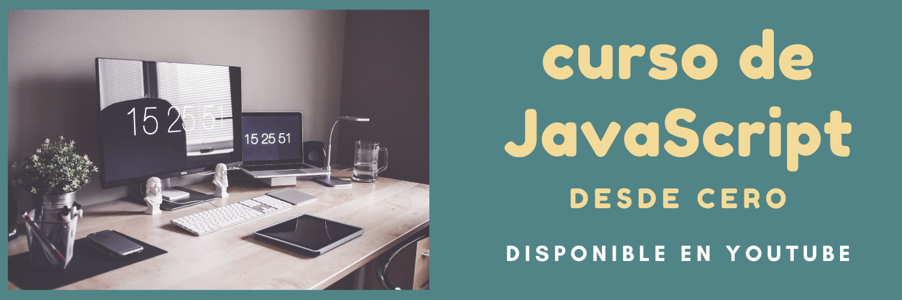

---

¿Quieres aprender JavaScript desde cero y no sabes por dónde empezar? ¡Tengo justo lo que necesitas! 🎉  

Este curso de **[JavaScript desde Cero](https://www.youtube.com/playlist?list=PLSCzMZKEz1xQWma_PktjXQBEC-fAmOa86)**, disponible en mi canal de YouTube, es perfecto para quienes están comenzando en el mundo de la programación o desean reforzar sus bases. Aprende a tu ritmo y paso a paso, con explicaciones claras y ejemplos prácticos.  

<!-- truncate -->

## ¿Qué encontrarás en este curso?  

🔸 Conceptos fundamentales de JavaScript.  
🔸 Ejercicios prácticos para aprender de manera interactiva.  
🔸 Explicaciones claras para entender la lógica de programación.  
🔸 Tips y buenas prácticas para escribir código eficiente.  

## ¿Cómo acceder al curso?  

El curso está completamente **gratis** en YouTube. Puedes verlo en esta **[lista de reproducción](https://www.youtube.com/playlist?list=PLSCzMZKEz1xQWma_PktjXQBEC-fAmOa86)**. ¡No olvides suscribirte al canal para más contenido como este!  

---
