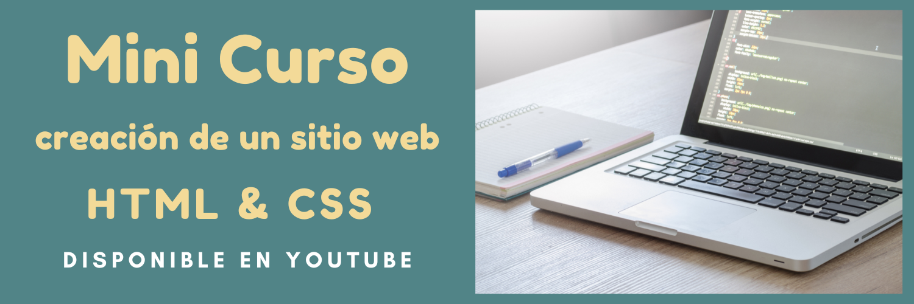

---

¿Quieres aprender a crear un sitio web desde cero? 🌐  

Con este **[mini curso de HTML y CSS](https://www.youtube.com/playlist?list=PLSCzMZKEz1xTzLsNBSELR75zQrBJQhVgd)** aprenderás a desarrollar un sitio web sencillo utilizando las bases de HTML, CSS y Flexbox. Es perfecto para principiantes que quieren dar sus primeros pasos en el desarrollo web.  

<!-- truncate -->

## ¿Qué aprenderás en este mini curso?  

🔸 Estructurar una página web con HTML.  
🔸 Diseñar estilos modernos utilizando CSS.  
🔸 Utilizar Flexbox para crear layouts responsivos y bien organizados.  
🔸 Consejos prácticos para proyectos básicos de desarrollo web.  

## ¿Por qué deberías tomar este mini curso?  

Porque está diseñado para que aprendas de manera clara y sencilla, con explicaciones paso a paso y ejemplos prácticos. Al finalizar, tendrás un sitio web funcional que podrás seguir mejorando.  

## ¿Cómo acceder al mini curso?  

El curso está disponible **gratis** en YouTube. Encuentra todos los videos en la **[lista de reproducción](https://www.youtube.com/playlist?list=PLSCzMZKEz1xTzLsNBSELR75zQrBJQhVgd)**. ¡No olvides suscribirte para más contenido!  

---  
