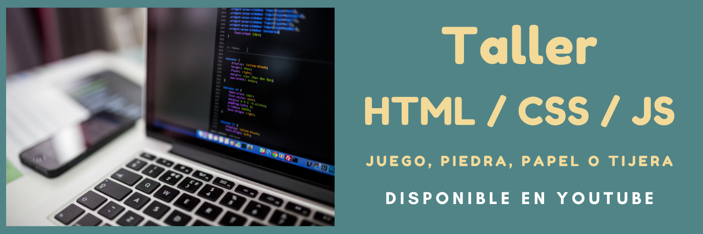

---

¿Te gustaría aprender HTML, CSS y JavaScript mientras creas un proyecto práctico? 🎮  

En este taller de **[HTML, CSS y JavaScript](https://www.youtube.com/playlist?list=PLSCzMZKEz1xRv2AAf_z0Gdpd1XJIh5GVf)** aprenderás paso a paso cómo construir un **juego de Piedra, Papel o Tijera** totalmente funcional. Es ideal para principiantes o para quienes quieren poner en práctica sus habilidades de programación.  

<!-- truncate -->

## ¿Qué aprenderás en este taller?  

🔸 Estructurar tu proyecto con HTML.  
🔸 Diseñar estilos atractivos utilizando CSS.  
🔸 Aplicar lógica de programación con JavaScript para crear la funcionalidad del juego.  
🔸 Buenas prácticas para el desarrollo de proyectos web.  

## ¿Por qué este taller es para ti?  

Porque aprenderás de manera práctica y divertida, enfocándote en la construcción de un proyecto concreto que podrás personalizar y compartir.  

## ¿Cómo acceder al taller?  

El taller está disponible **gratis** en YouTube. Encuentra todos los videos en la **[lista de reproducción](https://www.youtube.com/playlist?list=PLSCzMZKEz1xRv2AAf_z0Gdpd1XJIh5GVf)**. ¡Suscríbete para no perderte más contenido como este!  

---  
