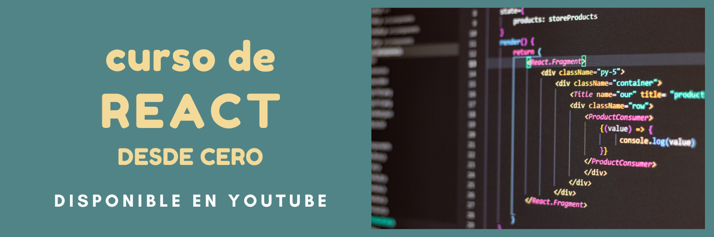

---

¿Quieres aprender **React JS** y no sabes por dónde empezar? Este **[curso de Desarrollo Web con React desde Cero](https://www.youtube.com/playlist?list=PLSCzMZKEz1xSUqTOSbSPQY5dgmHLjHhXJ)** es justo lo que necesitas. ¡Empieza desde lo básico y avanza hasta crear una landing page funcional! 🚀  

<!-- truncate -->

## ¿Qué aprenderás en este curso?  

🔸 **Configuración del entorno de desarrollo:** Aprende a usar Vite para crear proyectos rápidos y eficientes.  
🔸 **Bases de React JS:** Props, estados, hooks, renderizado condicional, eventos y más.  
🔸 **Proyecto práctico:** Desarrolla una landing page completa utilizando React.  

## ¿Por qué React y Vite?  

React JS es una de las bibliotecas más populares para construir interfaces de usuario interactivas, mientras que Vite es una herramienta moderna que acelera la configuración y el desarrollo de proyectos React. Juntos, son el dúo perfecto para empezar en el mundo del frontend.  

## ¿Cómo acceder al curso?  

El curso está disponible **gratis** en YouTube. Encuentra todos los videos en la **[lista de reproducción](https://www.youtube.com/playlist?list=PLSCzMZKEz1xSUqTOSbSPQY5dgmHLjHhXJ)**.  

Si aún no conoces JavaScript, te recomiendo empezar con el **[curso de JavaScript desde Cero](https://www.youtube.com/playlist?list=PLSCzMZKEz1xQWma_PktjXQBEC-fAmOa86)**.  

---

